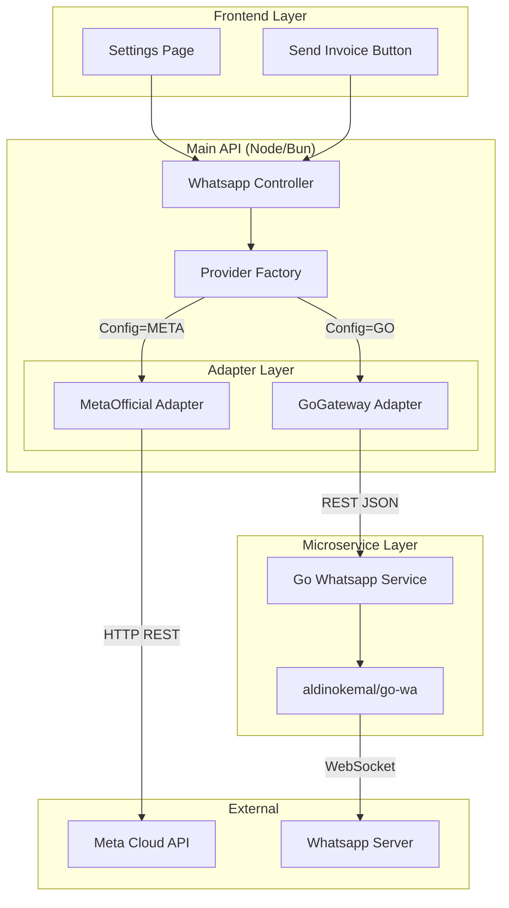

# Whatsapp Integration Plan (Dual Stack)

Dokumen ini merinci rencana implementasi fitur notifikasi Whatsapp menggunakan arsitektur **Dual Stack** (Official & Unofficial) dengan Adapter Pattern.

## 1. Arsitektur Sistem

Kita akan memisahkan logic Whatsapp Unofficial ke dalam microservice terpisah (Go) untuk stabilitas, sementara menanamkan logic Official (HTTP Call ke Meta) di dalam aplikasi utama sebagai Adapter.



---

## 2. Fase Implementasi

### Phase 1: Go Microservice Setup (Unofficial)
Membangun service "HP Virtual" menggunakan bahasa Go.

- **Lokasi**: `apps/whatsapp-bot/`
- **Dependencies**:
  - `github.com/gofiber/fiber/v2` (HTTP Framework)
  - `github.com/skip2/go-qrcode` (QR Generator)
- **API Specification**:
  - `POST /login`: Return `{ qr_code: "base64...", status: "SCANNING" }`
  - `GET /status`: Return `{ status: "CONNECTED" | "DISCONNECTED" }`
  - `POST /send-message`: Body `{ phone: "6281...", message: "text" }`
  - `POST /send-media`: Body `{ phone: "6281...", url: "http...", caption: "text" }`

### Phase 2: Main API Adapter (Interface Layer)
Membangun abstraksi di `apps/backend` agar bisa switch provider dengan mudah.

- **Interface**:
  ```typescript
  interface IWhatsappProvider {
    initialize(): Promise<void>;
    getConnectionStatus(): Promise<ConnectionStatus>;
    sendMessage(to: string, message: string): Promise<boolean>;
    sendPdf(to: string, pdfUrl: string, caption?: string): Promise<boolean>;
    getQrCode?(): Promise<string | null>; // Optional, khusus Unofficial
  }
  ```
- **Environment Variables**:
  - `WA_PROVIDER`: `GO_WA` | `META_OFFICIAL`
  - `WA_GO_SERVICE_URL`: `http://whatsapp-bot:3000`

### Phase 3: Frontend UI
Menambahkan kontrol panel di aplikasi web.

- **Halaman**: `/settings/whatsapp`
- **Fitur**:
  - **Provider Selector**: Dropdown (Recommended: Unofficial untuk dev/small scale).
  - **QR Section**: Auto-refresh QR image setiap 15 detik jika status = SCANNING.
  - **Status Badge**: Hijau (Connected) / Merah (Disconnected).
  - **Disconnect Button**: Untuk logout sesi.

### Phase 4: Integration Points
Menghubungkan fitur Invoice dengan WA.

- **Trigger**: Tombol "Share" -> "Send via Whatsapp".
- **Flow**:
  1. Generate Public Invoice Link.
  2. Create standard message: *"Halo, berikut invoice Anda: {link}"*.
  3. Call API Backend.

---

## 3. Struktur Folder Baru

```bash
apps/
├── whatsapp-bot/          # [NEW] Go Microservice
│   ├── cmd/main.go
│   ├── internal/
│   │   ├── handler/       # HTTP Handlers
│   │   ├── service/       # WA Logic
│   │   └── config/
│   ├── Dockerfile
│   └── go.mod
├── backend/
│   └── src/
│       └── services/
│           └── whatsapp/  # [NEW] Adapter Layer
│               ├── index.ts (Factory)
│               ├── types.ts
│               ├── adapters/
│               │   ├── go-gateway.adapter.ts
│               │   └── meta-official.adapter.ts
```